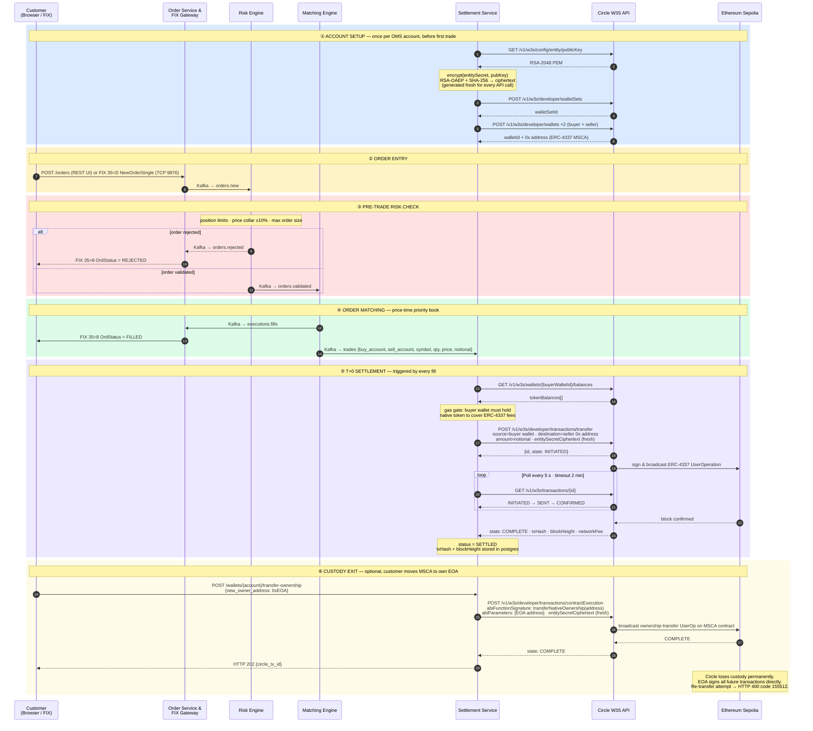

# Exchange OMS

A containerised Exchange Order Management System built with Python, FIX 4.4, Apache Kafka, and Docker. Includes a React web UI for full order CRUD.

## DeFi Settlement — Circle T+0

Every matched trade triggers an instant on-chain USDC settlement via Circle's
**Programmable Wallets (W3S)** API. Each OMS account maps to a Circle-managed
**ERC-4337 Smart Contract Account (MSCA)** on Ethereum Sepolia (or any
Circle-supported chain). The entity secret is never transmitted in plaintext —
it is RSA-OAEP encrypted client-side before each API call.



```
  OMS Pipeline            Settlement Service          Circle W3S API            Ethereum Sepolia
  ─────────────────────   ──────────────────────────  ────────────────────────  ─────────────────
  Matching Engine
  buy + sell cross
        │
  TradeEvent ────────────►consume trades topic
  (Kafka: trades)

                          ── ① Wallet Setup ─────────────────────────────────── (first use only)
                          GET publicKey ─────────────►/config/entity/publicKey
                         ◄───────────────────────────RSA-2048 PEM

                          encrypt(entitySecret,       ← generated fresh each
                            pubKey, OAEP+SHA256)         call; OAEP is non-
                            → ciphertext                 deterministic

                          POST walletSets ────────────►/developer/walletSets
                         ◄───────────────────────────  walletSetId

                          POST wallets (×2) ──────────►/developer/wallets
                         ◄───────────────────────────  walletId  + 0x address
                          buyer SCA / seller SCA       (ERC-4337 MSCA)

                          ── ② Gas Gate ─────────────────────────────────────────────────────────
                          GET balances ───────────────►/wallets/{id}/balances
                         ◄───────────────────────────  tokenBalances[]
                          ✗ no native token → FAILED   buyer must hold ETH for gas

                          ── ③ Initiate Transfer ────────────────────────────────────────────────
                          POST transfer ──────────────►/developer/transactions/transfer
                            walletId (buyer)             entitySecretCiphertext (fresh)
                            destinationAddress (seller)  amounts, feeLevel, blockchain
                         ◄───────────────────────────  { id, state: INITIATED }
                                                                  │
                                                           sign & broadcast ──────────► ERC-4337
                                                           UserOperation                UserOp on-chain

                          ── ④ Poll Status (every 5 s, up to 2 min) ────────────────────────────
                          GET transaction ────────────►/transactions/{id}
                         ◄───────────────────────────  INITIATED
                         ◄───────────────────────────  SENT
                         ◄───────────────────────────  CONFIRMED  ◄──────────────── block mined
                         ◄───────────────────────────  COMPLETE
                            txHash + blockHeight
                            network_fee stored

                          status → SETTLED ✓
                          (postgres: settlements)
```

### Wallet Ownership Transfer (optional exit path)

Circle holds custody of each MSCA by default. Ownership can be moved to an
external EOA at any time — after which Circle loses signing authority and the
EOA transacts directly on-chain.

```
  REST Client             Settlement Service          Circle W3S API            Ethereum Sepolia
  ─────────────────────   ──────────────────────────  ────────────────────────  ─────────────────

  POST /wallets/{account}
  /transfer-ownership
  { new_owner_address } ─►POST contractExecution ────►/developer/transactions/contractExecution
                            walletId (MSCA)              abiFunctionSignature:
                            contractAddress (MSCA)         transferNativeOwnership(address)
                            entitySecretCiphertext         abiParameters: [EOA address]
                         ◄───────────────────────────  { id, state: INITIATED }
                                                                  │
                                                           call contract ─────────────────────► MSCA
  202 { circle_tx_id } ◄─                                                                       transferNativeOwnership
                                                                                                (EOA confirmed)

  ✗ Any further Circle-signed transaction now returns:
    HTTP 400 · code 155512 · "SCA wallet without owner wallet"
```

| Settlement status | Meaning |
|---|---|
| `PENDING` | TradeEvent received, wallets being provisioned |
| `PROCESSING` | Circle transfer initiated, waiting for on-chain confirmation |
| `SETTLED` | Transaction `COMPLETE` on-chain; `tx_hash` + `block_height` recorded |
| `FAILED` | Gas gate failed, Circle rejected transfer, or polling timed out |

**Swagger UI:** `http://localhost:8004/docs`

| Endpoint | Description |
|---|---|
| `GET /settlements` | All settlements (filter by `status`, `symbol`) |
| `GET /settlements/{id}` | Single settlement with on-chain details |
| `GET /wallets` | All provisioned Circle SCA wallets and addresses |
| `GET /wallets/{account}/balances` | On-chain token balances |
| `POST /wallets/{account}/transfer-ownership` | Hand MSCA custody to external EOA |

---

## Architecture

```
┌─────────────────────────────────────────────────────────────┐
│                        Browser (React UI)                    │
│                        localhost:3001                        │
└──────────────────────────┬──────────────────────────────────┘
                           │ HTTP /api/*  (nginx proxy)
                           ▼
Client (FIX 4.4)     ┌──────────────┐
      │ TCP 9876      │ Order Service│◄─── orders.validated ──────────┐
      ▼               │  (FastAPI +  │◄─── executions.fills ──────────┤
┌─────────────┐       │  PostgreSQL) │──── executions.reports ───┐    │
│ FIX Gateway │       └──────────────┘                           │    │
│ (QuickFIX)  │─── orders.new ──►┌──────────────┐               │    │
└─────────────┘                  │ Risk Engine  │── orders.validated ─►│
      ▲                          │              │── orders.rejected ──►│
      │ executions.reports       └──────────────┘               │    │
      └──────────────────────────────────────────────────────────┘    │
                                                                       │
                                                              ┌─────────────────┐
                                                              │ Matching Engine │
                                                              │  (Order Book)   │
                                                              └────────┬────────┘
                                                                       │ market.data.updates
                                                                       ▼
                                                              ┌──────────────────┐
Client (FIX 4.4) ◄── 35=W/X ────────────────────────────────│ Market Data Svc  │
                             TCP 9877                         └──────────────────┘
```

## Services

| Service | Role | Port |
|---|---|---|
| `ui` | React + Vite SPA; nginx proxies `/api/*` to order-service | **3001** |
| `fix-gateway` | QuickFIX/Python FIX 4.4 acceptor; translates FIX messages to/from Kafka | 9876 |
| `order-service` | Order lifecycle management, PostgreSQL persistence, REST API | 8001 |
| `matching-engine` | In-memory price-time priority order book | — |
| `risk-engine` | Pre-trade risk checks: position limits, order size, price collars | — |
| `market-data-service` | Publishes FIX 35=W/X order book snapshots to subscribed clients | 9877 |

## Infrastructure

| Service | Purpose | Port |
|---|---|---|
| Kafka | Event bus for all inter-service messaging | 9092 |
| PostgreSQL | Persistent storage for orders, executions, positions | 5432 |
| Redis | Position cache for risk engine; FIX session state | 6379 |
| Prometheus | Metrics scraping | 9090 |
| Grafana | Dashboards (auto-provisioned) | 3000 |
| Loki + Promtail | Log aggregation | 3100 |
| Jaeger | Distributed tracing | 16686 |

## Kafka Topics

| Topic | Producer | Consumer(s) |
|---|---|---|
| `orders.new` | fix-gateway, order-service (UI) | risk-engine |
| `orders.validated` | risk-engine | matching-engine, order-service |
| `orders.rejected` | risk-engine | order-service |
| `orders.cancel` | order-service (UI) | matching-engine |
| `executions.fills` | matching-engine | order-service |
| `executions.reports` | order-service | fix-gateway |
| `market.data.updates` | matching-engine | market-data-service |

## FIX 4.4 Message Types

| MsgType | Name | Direction |
|---|---|---|
| 35=D | NewOrderSingle | Client → Gateway |
| 35=F | OrderCancelRequest | Client → Gateway |
| 35=G | OrderCancelReplaceRequest | Client → Gateway |
| 35=8 | ExecutionReport | Gateway → Client |
| 35=9 | OrderCancelReject | Gateway → Client |
| 35=V | MarketDataRequest | Client → Market Data Svc |
| 35=W | MarketDataSnapshotFullRefresh | Market Data Svc → Client |
| 35=X | MarketDataIncrementalRefresh | Market Data Svc → Client |

## Quick Start

**Prerequisites:** Docker 24+, Docker Compose v2

```bash
# 1. Clone and configure
cp .env.example .env

# 2. Build and start all 15 containers
make up

# 3. Verify services are healthy
docker compose ps
```

Check the UIs:

| UI | URL | Credentials |
|---|---|---|
| **OMS Web UI** | http://localhost:3001 | — |
| Grafana dashboards | http://localhost:3000 | admin / admin |
| Prometheus | http://localhost:9090 | — |
| Jaeger tracing | http://localhost:16686 | — |
| Order Service REST (Swagger) | http://localhost:8001/docs | — |

## Web UI

The React UI at **http://localhost:3001** provides full order lifecycle management directly in the browser, auto-refreshing every 3 seconds.

### Pages

| Page | Path | Features |
|---|---|---|
| Dashboard | `/dashboard` | Live stat cards (total / open / filled / rejected), positions summary, recent fills |
| Orders | `/orders` | Filterable table by account, symbol, status; **New Order** form; **Cancel** button; expandable execution sub-rows per order |
| Positions | `/positions` | Net quantity, avg cost, notional value per account/symbol; long/short count |
| Executions | `/executions` | All fills with total volume, filterable by symbol and account |

### Order flow from the UI

Orders submitted via the form publish directly to `orders.new` (bypassing the FIX gateway) and follow the same full Kafka pipeline — risk check → matching → execution report → persisted in PostgreSQL.

### Local development (without Docker)

```bash
# Start the order-service backend first, then:
make ui-dev   # runs Vite dev server at localhost:5173
              # proxies /api/* → localhost:8001 automatically
```

## Configuration

All configuration is driven by environment variables in `.env`. Copy `.env.example` to get started:

| Variable | Default | Description |
|---|---|---|
| `POSTGRES_PASSWORD` | `oms_secret` | PostgreSQL password |
| `KAFKA_BOOTSTRAP` | `kafka:9092` | Kafka bootstrap address |
| `REDIS_URL` | `redis://redis:6379/0` | Redis connection URL |
| `PRICE_COLLAR_PCT` | `0.10` | Pre-trade price collar width (±10%) |
| `OTEL_EXPORTER_OTLP_ENDPOINT` | `http://jaeger:4317` | Jaeger OTLP endpoint |
| `GF_SECURITY_ADMIN_PASSWORD` | `admin` | Grafana admin password |

FIX session configuration lives in:
- `services/fix-gateway/src/config/fix44.cfg` — order entry gateway (port 9876)
- `services/market-data-service/src/config/fix44_md.cfg` — market data feed (port 9877)

Add new FIX client sessions by appending `[SESSION]` blocks with `TargetCompID` for each counterparty.

Instruments and risk limits are seeded in `infra/postgres/init.sql` and `services/risk-engine/src/instruments.json`.

## Testing

```bash
# Unit tests — order book matching logic
make unit-test

# Integration test — sends a FIX NewOrderSingle, expects ExecutionReports
make test
```

The integration test (`tests/fix_client_simulator.py`) connects as a FIX initiator, sends a matching buy/sell pair, and asserts that ExecutionReport (35=8) messages are received.

## REST API

The order service exposes a full REST API at `http://localhost:8001` (Swagger UI at `/docs`):

```bash
# List orders (filters: ?account=X&symbol=Y&status=Z)
curl http://localhost:8001/orders

# Submit a new order (routes through Kafka → risk → matching)
curl -X POST http://localhost:8001/orders \
  -H 'Content-Type: application/json' \
  -d '{"account":"ACC1","symbol":"AAPL","side":"1","ord_type":"2","quantity":"100","price":"150.00"}'

# Cancel an open order
curl -X DELETE http://localhost:8001/orders/{order_id}

# Executions for a specific order
curl http://localhost:8001/orders/{order_id}/executions

# All executions (filters: ?symbol=X&account=Y)
curl http://localhost:8001/executions

# Positions (filter: ?account=X)
curl http://localhost:8001/positions

# Health check
curl http://localhost:8001/health
```

Side values: `"1"` = Buy, `"2"` = Sell  
Order type values: `"1"` = Market, `"2"` = Limit

## Project Layout

```
OMS/
├── docker-compose.yml
├── .env.example
├── Makefile
├── shared/                      # Shared Python package (oms_shared)
│   └── oms_shared/
│       ├── models.py            # Pydantic event models
│       ├── kafka_utils.py       # Producer/consumer helpers
│       └── telemetry.py         # OpenTelemetry + structlog + Prometheus setup
├── services/
│   ├── ui/                      # React + Vite SPA (nginx, port 3001)
│   │   ├── src/
│   │   │   ├── pages/           # Dashboard, Orders, Positions, Executions
│   │   │   └── components/      # Navbar, NewOrderModal, StatusBadge, SideTag, StatCard
│   │   ├── nginx.conf           # Proxy /api/* → order-service, SPA fallback
│   │   └── Dockerfile           # node:20-alpine build → nginx:alpine
│   ├── fix-gateway/             # FIX 4.4 acceptor + Kafka bridge
│   ├── order-service/           # FastAPI + PostgreSQL + Kafka consumer
│   ├── matching-engine/         # Price-time priority order book
│   ├── risk-engine/             # Pre-trade risk checks
│   └── market-data-service/     # FIX market data publisher
├── infra/
│   ├── postgres/init.sql        # Schema + seed instruments
│   ├── kafka/create_topics.sh   # Topic provisioning (7 topics)
│   ├── prometheus/              # Scrape config
│   ├── grafana/                 # Auto-provisioned datasources + OMS dashboard
│   ├── loki/                    # Log aggregation config
│   └── jaeger/                  # Tracing (all-in-one)
├── k8s/                         # Kubernetes manifests for EKS
│   ├── kustomization.yaml       # Apply everything: kubectl apply -k k8s/
│   ├── deploy.sh                # Build → push ECR → deploy script
│   ├── namespace.yaml
│   ├── configmap.yaml
│   ├── secret.yaml              # Template — fill in real values
│   ├── serviceaccount.yaml      # IRSA service account
│   ├── ingress.yaml             # ALB Ingress (UI + API)
│   ├── {fix-gateway,order-service,matching-engine,risk-engine,market-data-service,ui}/
│   │   ├── deployment.yaml
│   │   ├── service.yaml
│   │   └── hpa.yaml             # order-service and risk-engine only
│   └── infra/                   # In-cluster infra (dev/staging only)
│       ├── zookeeper.yaml
│       ├── kafka.yaml
│       ├── kafka-init-job.yaml
│       ├── postgres.yaml
│       └── redis.yaml
└── tests/
    ├── test_matching_engine.py  # Unit tests for order book
    └── fix_client_simulator.py  # FIX initiator integration test
```

## Observability

Every service emits:

- **Structured JSON logs** → stdout → Promtail → Loki (queryable in Grafana)
- **Prometheus metrics** — `oms_orders_received_total`, `oms_orders_rejected_total`, `oms_fills_total`, `oms_order_latency_seconds`
- **OpenTelemetry traces** → Jaeger (spans cross fix-gateway → risk-engine → matching-engine → order-service)

The Grafana OMS dashboard is auto-provisioned at startup and shows order throughput, fill rate by symbol, p99 latency, and rejection breakdown.

## Kubernetes / EKS

### Prerequisites

| Tool | Purpose |
|---|---|
| `kubectl` | Cluster interaction |
| `aws` CLI | ECR login, kubeconfig update |
| `docker buildx` | Multi-arch image builds |
| [AWS Load Balancer Controller](https://kubernetes-sigs.github.io/aws-load-balancer-controller/) | ALB Ingress + NLB Services |
| EBS CSI driver | `gp2` PersistentVolumeClaims for in-cluster infra |

### Architecture on EKS

```
Internet
   │
   ├── NLB (TCP 9876) ──► fix-gateway pod          (amd64 node)
   ├── NLB (TCP 9877) ──► market-data-service pod   (amd64 node)
   └── ALB (HTTPS 443)
         ├── /api/* ──► order-service pods   (2–10 replicas, HPA)
         └── /*     ──► ui pods              (2 replicas)

 Internal (ClusterIP)
   ├── matching-engine  (1 replica — stateful in-memory order book)
   ├── risk-engine      (2–6 replicas, HPA)
   ├── kafka-broker     StatefulSet + 20 Gi EBS  [dev/staging only]
   ├── postgres         StatefulSet + 20 Gi EBS  [dev/staging only]
   └── redis            StatefulSet +  5 Gi EBS  [dev/staging only]
```

**Production managed services** — replace in-cluster infra with:
- Kafka → **Amazon MSK** (update `KAFKA_BOOTSTRAP` in `k8s/configmap.yaml`)
- PostgreSQL → **Amazon RDS** (update `DATABASE_URL` in `k8s/secret.yaml`)
- Redis → **Amazon ElastiCache** (update `REDIS_URL` in `k8s/configmap.yaml`)

### Quickstart

```bash
export AWS_ACCOUNT_ID=123456789012
export AWS_REGION=us-east-1
export CLUSTER_NAME=oms-eks
export IMAGE_TAG=v1.0.0

# 1. Fill in real values (passwords, RDS/MSK/ElastiCache endpoints, cert ARN)
vi k8s/secret.yaml
vi k8s/configmap.yaml
vi k8s/ingress.yaml       # set alb.ingress.kubernetes.io/certificate-arn

# 2. Deploy in-cluster infra (skip for production — use MSK/RDS/ElastiCache)
./k8s/deploy.sh --infra

# 3. Build images, push to ECR, deploy app
./k8s/deploy.sh --app

# Or do everything at once
./k8s/deploy.sh --all
```

### Node group requirements

| Node arch | Used by |
|---|---|
| `amd64` | fix-gateway, market-data-service (quickfix x86 assembly) |
| `amd64` or `arm64` | order-service, matching-engine, risk-engine, ui |

### Useful kubectl commands

```bash
# Watch all OMS pods
kubectl get pods -n oms -w

# Tail logs for a service
kubectl logs -n oms -l app=order-service -f

# Check HPA status
kubectl get hpa -n oms

# Get ALB DNS name (UI + API)
kubectl get ingress oms-ingress -n oms

# Get NLB DNS name (FIX order entry)
kubectl get svc fix-gateway-nlb -n oms
```

### Applying manifests manually

```bash
# Apply everything (namespace → infra → app → ingress)
kubectl apply -k k8s/

# Apply app only (after infra is up and MSK/RDS endpoints are set)
kubectl apply -f k8s/namespace.yaml
kubectl apply -f k8s/configmap.yaml
kubectl apply -f k8s/secret.yaml
for svc in fix-gateway order-service matching-engine risk-engine market-data-service ui; do
  kubectl apply -f k8s/$svc/
done
kubectl apply -f k8s/ingress.yaml
```

## Stopping

```bash
make down        # stop Docker containers, preserve volumes
make clean       # stop Docker containers and delete all volumes

# Tear down EKS deployment
kubectl delete namespace oms
```
